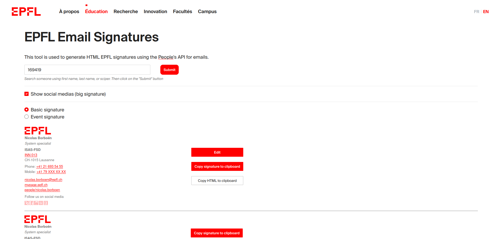

# [EPFL Email Signatures](https://people.epfl.ch/signatures/)
EPFL Email Signatures is a web application created to standardize email signatures at [EPFL](https://epfl.ch).

It was made as simple as possible so it can be used by anybody.

<!-- TOC titleSize:2 tabSpaces:2 depthFrom:2 depthTo:6 withLinks:1 updateOnSave:1 orderedList:0 skip:0 title:1 charForUnorderedList:* -->
## Table of Contents
* [Features](#features)
* [Technologies](#technologies)
* [Screenshot](#screenshot)
* [Help / More](#help--more)
* [Contributors](#contributors)
<!-- /TOC -->

## Features
* [WYSIWYG](https://fr.wikipedia.org/wiki/What_you_see_is_what_you_get) editor to write anything you want under the signature
* Automatic data completion by searching people
* Remove / Define data that is not defined (office, personal website, mobile phone number, ...)
* Easy copy/paste signature (HTML copy or visual copy) for any email clients
* Three different sizes for personal signatures
* Signature for events with resizable personal image (URL)
* EN/FR signatures
* Shareable signatures using queryString (image URL, image size, sciper, ...)
* Optional EPFL social medias on all signatures

## Technologies
* [search-api](https://github.com/epfl-si/search-api) : For searching people at EPFL using sciper, first name, last name...
* [jQuery](https://jquery.com/) : A lot of the page content is changed without reloading, jQuery makes things easier.
* [jQuery UI](https://jqueryui.com/) : For image Resizing
* [Web2018 Elements](https://web2018.epfl.ch) : For the "EPFL style"
* [tinyMCE](https://www.tiny.cloud/) : For the WYSIWYG editors
* HTML/CSS/JS

## Screenshot

<small><i>More to discover on the [website](https://people.epfl.ch/signatures/)...</i></small>

## Help / More
If you need more information about the project or details on how to implement the signatures in different email clients, you can read the [DOCUMENTATION.md](./DOCUMENTATION.md) file.

## Contributors
[@Azecko](https://github.com/Azecko)
